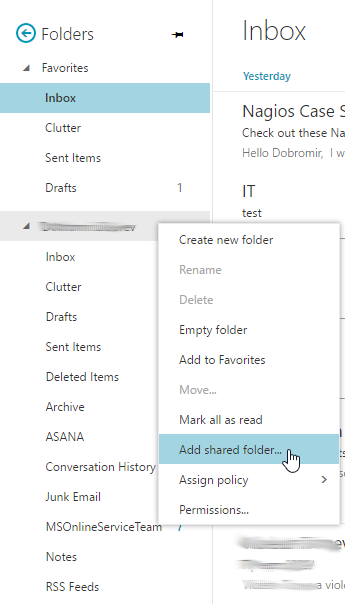
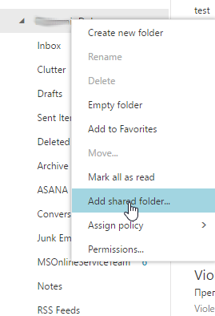
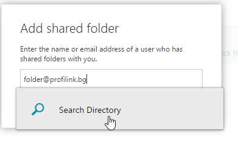

В това ръководство ще се научим как да добавяме споделени пощенски кутии(Shared Mailbox), към вече съществуващата ни лична поща в Office 365.

1. Добавянето на споделени кутии, към личната ни поща става посредством натискаме на десен бутон на мишката върху личната ви пощенска кутия(обикновенно това е папката в вашите Име Фамилия). След това избираме **"Add Shared Folder"**.
   
2. На екарана се е появи нов прозорен с наименование "Add share folder" и празно поле, където можем да въведем името на кутията, която искаме да добавим.
   >*можем да използваме бутона **Search Directory**, което ще ни покаже дали дали тази кутия съществува в базата на Office 365.
   
3. Новодобавената кутия се намира, най-отдолу в пощата ви. Стрелката пред името на споделената кутия, я "отваря" и показва съдържанието ѝ. 
   
